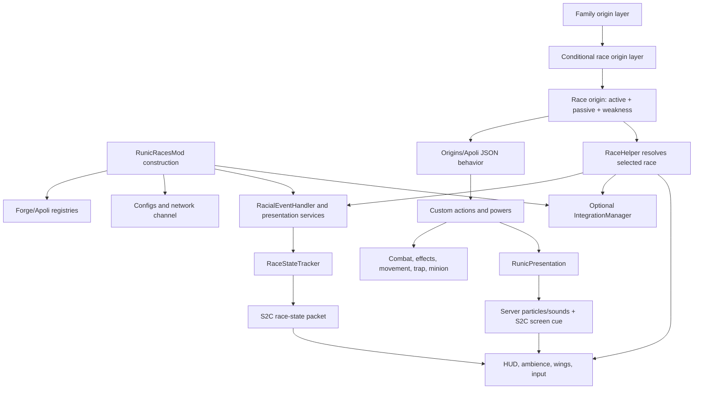

# Runic Races — Optimization, Cleanup, and Enhancement Plan

**Target:** Minecraft 1.20.1, Forge 47.x, Java 17, Origins Forge 1.10.x  
**Audited snapshot:** Runic Races 1.6.0, 2026-08-14  
**Audience:** coding agents and maintainers performing planning, implementation, validation, and release work  
**Status:** implementation roadmap; no gameplay changes in this document

## 1. Objective and non-negotiable constraints

Modernize Runic Races without losing its defining shape: 37 races in 7 families, a two-stage Family → Race selection flow, and exactly one active, one passive, and one weakness per race. The result should be easier to extend, cheaper to run, safer in multiplayer, visually clearer, and more internally consistent.

The implementation must preserve these constraints:

- Remain on Minecraft 1.20.1 and Forge 47.x unless a separate migration project is approved.
- Keep the existing origin, power, item, entity, sound, particle, and translation IDs whenever possible. Existing worlds and datapacks must not break merely because code was reorganized.
- Keep gameplay server-authoritative. Client code may predict presentation, but never damage, costs, cooldowns, state, revival, or movement authority.
- Keep Origins Forge as the only hard gameplay dependency. Optional integrations must remain optional and must fail in a documented, testable way.
- Preserve the three-power identity contract. Extra Java mechanics such as Nine Lives, adaptation, lifesteal, crafting procs, shoulder-checks, and revival must be surfaced as part of those three powers rather than becoming invisible fourth or fifth powers.
- Prefer readable counterplay and distinct play patterns over mathematical symmetry. “Fun and fair” is the goal; a nominal sum of bonuses and penalties is not sufficient evidence of balance.
- Treat accessibility, multiplayer friendliness, and reduced-motion behavior as functional requirements, not final-pass polish.

## 2. Audited baseline

### 2.1 Repository inventory

The audited tree contains:

- 96 production Java classes and 24 Java test classes.
- 44 origin definitions: 7 family origins and 37 race origins.
- 111 power JSON files: exactly 3 per race.
- 2 origin layers: `runic_races:family` and `runic_races:race`.
- 18 custom particle types, 38 item models, 159 textures, one trap block, one temporary minion entity, and a curated `sounds.json` built from vanilla sound events.
- Three config surfaces: common, server, and client.
- Six network packets on protocol version 2, with an append-only discriminator test.
- Optional adapters for Ars Nouveau, Iron's Spells 'n Spellbooks, Curios, Apotheosis, Pehkui, and Feather's Mod.
- Python generators for race data, language, icons, wings, particles, overlays, and runes.
- CI that fetches local compile-only jars, then runs `compileJava` and `test`.

The worktree was clean before this plan was added. `AUDIT_REPORT.md` is a historical audit of older behavior; many of its findings were fixed in 1.2–1.6 and it must not be treated as the current source of truth. `BALANCE.md`, committed power JSON, and current Java behavior disagree in a few places, so all three must be reconciled during Phase 1.

### 2.2 Verification status at audit time

`gradlew.bat test --no-daemon` was attempted with a fresh workspace-local Gradle cache. Gradle and the Forge 1.20.1 userdev artifact resolved, but `compileJava` failed with 187 missing-type errors because the gitignored `Dependencies/` jars for Origins/Apoli/Calio, Ars Nouveau, Iron's Spellbooks, and Curios were not present. The test task therefore did not execute. This is a baseline/build-provisioning failure, not evidence of a source regression, and directly motivates RR-011 and Phase 0. CI's separate `ci/fetch-deps.sh` currently supplies these files.

### 2.3 Strengths to preserve

- The Family → Race selection structure is clear, constrained, and extensible by datapack.
- Race IDs and the three-power convention are consistent across all 37 origins.
- Flight flap authority is correctly server-side and rejects non-gliding/rate-limited requests before applying movement.
- `Hostility` has already consolidated most offensive AoE ally/PvP checks.
- Race lookup is explicit to the race layer and memoized within a tick.
- Optional mod classes are loaded behind presence/config checks instead of being eagerly referenced from the main bootstrap.
- Presentation has a useful semantic key registry, family palettes, tier vocabulary, delayed beats, and coverage tests.
- Existing tests catch many high-value data errors: missing assets/lang, stale files, resource ID drift, append-only packet order, unsafe area-of-effect use, malformed intervals, VFX tier drift, wing coverage, and race/data parity.
- Server particle densities, client accessibility controls, state notifications, debug commands, and a compatibility warning already provide good foundations to refine.

### 2.4 Current runtime architecture



#### Current responsibility map

| Area | Current owners | Interaction boundary |
|---|---|---|
| Bootstrap and registries | `RunicRacesMod`, `registry/*` | Registers Apoli factories, items, entity, trap block/entity, particles, sounds, configs, packets, events, and integrations. |
| Race data | `data/runic_races/origin_layers`, `origins`, `powers` | Origins owns selection and most attribute/effect/cooldown behavior. Custom `runic_races:*` types enter Java here. |
| Race metadata/lookup | `race/RaceRegistry`, `RaceDefinition`, `util/RaceHelper` | Supplies integration/UI metadata and maps a player's Origins container to the current race/family. |
| Cross-cutting gameplay | `event/RacialEventHandler` | Adds Java-only death, combat, crafting, food, adaptation, state, jump, and clone mechanics. |
| Apoli extensions | `action/*`, `condition/*`, `power/*`, `registry/ModEntityActions`, `ModEntityConditions`, `ModPowerFactories` | Decodes datapack configuration and executes custom server behavior or ticking modifiers. |
| Targeting and external resources | `util/Hostility`, `ManaHelper`, `StaminaHelper`, `OriginsPowerHelper` | Centralizes threat filtering and reflective access to optional resource APIs/Apoli values. |
| State and notifications | `common/state/*`, `notification/*`, `presentation/WeaknessCueRegistry` | Maintains the server bitfield, sends edges, banners, and weakness onset cues. |
| Presentation | `presentation/*`, `network/S2CScreenCuePacket`, `client/presentation/*` | Resolves semantic signature keys into sounds, shaped particles, delayed beats, and local screen/camera/FOV effects. |
| Client identity | `client/RacialCooldownOverlay`, `StateRuneOverlay`, `ClientRacialAmbienceHandler`, `AbilityIconRegistry` | Polls cooldown/race data and renders HUD, ambient identity, and state feedback. |
| Flight and wings | `flight/*`, flap/cancel packets, `client/FlightInputHandler`, `client/render/*` | Validates powered flaps and renders race-specific wing geometry, pose, trails, landing, and banking. |
| Trap and summon | `block/TrapMarker*`, `entity/GraveServantEntity`, placement/summon actions | Persists temporary owner-bound world actors and applies their collision/AI effects. |
| Optional integrations | `integration/*` | Applies race metadata to Ars, Iron's, Curios, Apotheosis, Pehkui, and Feather's APIs. |
| Origins compatibility | `compat/*`, `client/OriginBackButtonHandler`, `C2SBackToFamilyPacket` | Controls the default Origins layer, warns about hidden foreign origins, and supports backing out during selection. |
| Operations/tooling | `command/RRCommands`, `tools/*`, `src/test/*`, `.github/workflows/ci.yml`, `ci/fetch-deps.sh` | Diagnostics, static generation, regression lint, dependency provisioning, and CI. |

### 2.5 Core execution flows

#### Race selection and lookup

1. Origins presents `runic_races:family`.
2. `runic_races:race` conditionally exposes only races in the selected family.
3. The client-injected Back button sends `C2SBackToFamilyPacket` only while the family is selected and the race is still unchosen.
4. `RaceHelper` reads the explicit race layer, memoizes by player UUID for the current tick, and falls back to scanning the Origins container when needed.
5. Event handlers, integrations, HUD, ambience, and wing rendering all branch on the resolved race string.

#### Active ability

1. Origins handles the primary-active key and checks the JSON cooldown resource.
2. A JSON action tree may check/spend mana or stamina, apply vanilla effects, invoke a custom action, fire a presentation signature, and increment the cooldown resource.
3. Custom actions perform server gameplay such as a breath cone, hostile-only affliction, glow, tremor, trap placement, cleanse, or minion summon.
4. `RunicPresentation` immediately broadcasts sounds/particles, sends the caster a screen cue/banner, and schedules delayed cosmetic beats.
5. The client cooldown overlay polls the Apoli resource and renders the ability slot.

#### Passive and weakness state

1. Most attributes, immunities, environmental conditions, and periodic actions live in power JSON.
2. `BiomeAffinityPower` and `ScalingAttributePower` add transient modifiers and separately mirror state into `RaceStateTracker`.
3. `RacialEventHandler` checks a second set of race-specific conditions every 10 ticks and toggles additional flags.
4. Each flag edge immediately sends a bitfield packet and may emit an action-bar notification and weakness presentation cue.
5. The client renders active runes from a single static bitfield.

#### Flight

1. Origins grants elytra-style flight; only Sprite, Faerie, Avian, and Wind Wyrm have powered flap configurations.
2. Dedicated flap/fold keybinds are optional. The fallback buffers Jump for four ticks: one press flaps, a second folds the wings.
3. `FlightFlapPacket` is validated server-side for race, fall-flying state, two-tick packet rate, Apoli cooldown, and optional Feather cost.
4. The server applies vertical velocity, stamps the cooldown resource, and fires a flap signature.
5. Wing pose, body banking, trails, and landing effects are client-rendered.

#### Persistence, death, and integration

1. Race-specific state is stored as raw namespaced keys in player persistent NBT.
2. `RacialEventHandler.onClone` copies all namespaced keys, including some transient markers.
3. Nine Lives intercepts lethal damage before death; Reaper records death position and attempts a post-respawn return.
4. `IntegrationManager` loads enabled adapters once, syncs on login/respawn/dimension, and polls for race changes every 20 ticks.
5. Curios slots, scale, max feathers, vanilla luck, mana economics, and spell damage are applied by separate adapters or registries.

## 3. Audit findings and required dispositions

“Confirmed” below means the behavior is directly present in the audited source/data. “Runtime verification” means Forge, Origins, rendering, or another mod may alter the observed in-game result and a GameTest/manual test is required before changing it.

| ID | Priority | Finding | Required disposition |
|---|---:|---|---|
| RR-001 | P0 | `tools/generate_races.py` claims authoritative output but is stale relative to committed JSON. Examples include Feline's 10-minute generated Nine Lives versus the committed 15 minutes, Valen −10%/−10% versus −8%/−8%, Canine +40% hunger versus +25%, Changeling 40 seconds/−10% versus 25 seconds/−5%, and older Sprite/Faerie/Zombie/Fire Drake values. Running it can regress released balance. | Establish one canonical catalog, make generation deterministic, and add a zero-diff `--check` CI gate before any balance work. |
| RR-002 | P0 | Missing-resource behavior is contradictory. Config/logging describe fail-closed behavior, but shipped action trees use `not(resource_available) OR has_resource`, which deliberately makes abilities free when the resource mod/API is unavailable. `HasManaCondition` comments also disagree with its default return path. | Replace the boolean with an explicit policy and an atomic check-and-spend API. Distinguish “mod absent by design” from “mod installed but API binding failed.” |
| RR-003 | P0 | Server state flags are changed one bit at a time only for the current race. Switching races can leave flags owned by the old race set. Client race flags, adaptation stacks, ambience timers/caches, denial timers, input buffers, and some overlay caches lack a common disconnect/world/race reset. | Compute and replace a complete state snapshot; add lifecycle reset hooks and race identity/version to synchronization. |
| RR-004 | P0 | Presentation sometimes promises mechanics that do not exist. Canine's active says it marks wounded prey but glows all threats; “Howl of the Pack” buffs only the caster. Moon Elf “under the night sky” healing only checks not-daytime. Nymph sets a dry warning despite no general dry penalty. Faerie cold-iron grip produces a warning/cue but no grip-specific gameplay penalty. Changeling and Wraith names promise disguise/incorporeality their effects do not provide. | Either implement the promise or rewrite the name, description, rune, notification, and VFX together. Add semantic parity tests for predicates and copy. |
| RR-005 | P0 | External resource spending is not atomic and accepts unbounded/negative codec values. The condition and consume action are separate; a failed/changed resource read can still allow subsequent effects and cooldown changes. Several custom action numeric fields also have no upper bound. | Use bounded codecs and a server-side `trySpend` result. Only execute gameplay and stamp cooldown after successful validation. |
| RR-006 | P0 | Target semantics are inconsistent. Hostility is centralized for most AoE actions, but traps can trigger on teammates/pets/other protected players, breaths intentionally hit neutral entities, Canine client scent uses a different threat rule, and summoned servants do not have a complete owner/team contract. | Introduce named target policies shared by every action and explicitly document exceptions. Test teams, PvP disabled, pets, owners, neutral mobs, creative/spectator players, and canceled damage. |
| RR-007 | P0 | Breath riders can apply even when `hurt()` returns false. Breath and trap damage use generic sources rather than elemental Runic Races damage types/tags. Breath cones do not define block occlusion, falloff, or target caps. | Add custom damage types/tags, apply riders only after accepted damage where appropriate, and make occlusion/falloff/caps explicit per element. |
| RR-008 | P0 | Integration adapters load/register once. Runtime config reload cannot truly disable registered event handlers, while player sync still visits the loaded adapter. Feather's reset restores a hardcoded 20 rather than the previous external baseline. Integration bonuses are duplicated in switch statements and can stack unexpectedly with JSON. | Give adapters explicit availability/enabled states, guard every callback, make mutations reversible, and centralize integration tuning in the race catalog. Document restart-only settings if live unload is unsafe. |
| RR-009 | P1 | Signature shapes call `sendParticles` for many individual points. Density is authored server-side, so each client cannot independently reduce signature load. `PresentationScheduler` scans/decrements an array every server tick. | Send a compact signature event with key, transform, seed, and tier; spawn cosmetic particles client-side with LOD and accessibility settings. Schedule by due server tick. |
| RR-010 | P1 | Several animations are frame-dependent: cooldown ready flashes, denial timers, wing smoothing, and body banking advance per render rather than per game tick/time delta. | Store game-tick timestamps and interpolate. Results must be stable at 30, 60, 144, and uncapped FPS. |
| RR-011 | P1 | The build is not reproducible from Gradle alone. ForgeGradle uses `6.0.+`; Origins/Apoli/Calio and three integrations are local files; CI fetches one Iron's version and renames it as another. | Pin every plugin/artifact and checksum. Resolve exact supported artifacts without filename masquerading, or fail with a precise setup task. Add dependency verification/locking. |
| RR-012 | P1 | Raw persistent NBT mixes durable cooldowns/adaptation/revival with transient latches, sync markers, and presentation state. Clone behavior copies every namespaced key rather than an explicit schema. | Introduce a versioned player capability/state object with per-field clone policy and migrations. Keep compatibility readers for existing keys. |
| RR-013 | P1 | `RacialEventHandler` is an 800+ line coordination point for death, combat, crafting, food, state, movement, jump compensation, and cloning. Numeric values and NBT names are duplicated in commands and docs. | Split into focused services and pure evaluators; keep Forge subscribers thin. Generate or query diagnostic output from the same state/tuning objects. |
| RR-014 | P1 | Existing VFX tests count JSON particles separately from Java signatures and exempt breath accents. They do not measure combined runtime particles, packets, visibility, distance, or concurrent casts. Generic screen-cue types can trigger heavy local flourishes without knowing the signature's actual tier. | Test a resolved presentation recipe, including action particles, signature beats, screen flourish, and LOD. Put key/tier/seed in the cue packet. |
| RR-015 | P1 | `ambient.stateParticles=false` or density zero returns from the entire ambience tick, disabling ambient sounds and wing trail/landing logic too. Static ambience timestamps can suppress effects after joining a world with a lower game time. `lastWetTick = Long.MIN_VALUE` makes `time - lastWetTick` overflow and can show a Sea Serpen “freshly wet” effect before first contact with water. | Split particle, sound, and wing-trail gates; reset per world/race; replace sentinel arithmetic with an explicit optional timestamp. |
| RR-016 | P1 | Body banking ignores wing visibility, show-other-players, and reduced-motion settings. Its smoothing updates per render frame. Wing flap animation infers flaps from velocity, so jumps/explosions can look like flaps. Runtime verification is also needed for pose-stack ownership in the Pre event. | Drive flap animation from a server-confirmed event, honor all relevant client settings, and validate pose restoration across renderers/mods. |
| RR-017 | P1 | A low-health Wind Wyrm broadcasts Ender Dragon ambience and clouds every 40 ticks. This is frequent, audible to nearby players, and not controlled separately from client ambience. | Make it local/subtle, add a long randomized cooldown, and provide an ambient-sound toggle/volume category. |
| RR-018 | P1 | The built-in clean-two-layer datapack's “required” status is derived during pack discovery. Existing world pack selection may not follow later config changes, and hidden foreign origins are only warned about after startup. | Add an explicit compatibility mode, startup report, `/runicraces validate layers`, and migration instructions for existing worlds. Test both modes with a foreign origin datapack. |
| RR-019 | P1 | `Universal Palate` removes any matching harmful food effect after consumption and may remove a pre-existing instance from another source. Adaptation can be farmed by alternating two mob types or biomes. | Snapshot effects before eating; track genuinely novel categories within a bounded recent-history window for adaptation. |
| RR-020 | P1 | Reaper safe return searches only vertically at the exact death X/Z, applies a long high-level Resistance effect, and needs explicit handling for dimensions, void/kill sources, obstructed columns, and old-world data. | Use bounded horizontal safe-position search, define eligible deaths/dimensions, tune protection, and add complete failure-path tests. Consume cooldown according to one documented rule. |
| RR-021 | P1 | Trap/minion actions accept configurations that can create unsafe or excessive runtime behavior. Traps have incongruous flame/explosion feedback; minions can spawn in collision and have limited owner-follow/defense logic. | Add per-owner caps, safe spawn checks, alliance rules, cleanup, matching web/soul presentation, and bounded lifetimes/counts/radii. |
| RR-022 | P2 | HUD ability names are hardcoded English, key lookup scans key mappings, non-keyed/passive slots can show misleading primary-key hints, and missing resources may appear ready. Commands use literal English and legacy formatting codes. | Use translation keys and explicit input bindings from the catalog. Show unknown/error state rather than ready. Localize player-facing command output. |
| RR-023 | P2 | Comments/docs contain stale race names, phase notes, old particle counts, and generator claims. Asset generators depend on undeclared Python/Pillow tooling and some source art outside the repository. | Make tooling self-contained and versioned; regenerate docs from catalog data; label historical audits; retain source/license/provenance for art. |

## 4. Target architecture

The cleanup should converge on the following ownership model.

```text
com.otectus.runic_races
├─ catalog/          canonical race, ability, tuning, integration, UI metadata
├─ ability/          validation, cost transaction, target policy, executors
│  ├─ breath/
│  ├─ trap/
│  └─ summon/
├─ combat/           damage types/tags, lifesteal, venom, Nine Lives
├─ state/            versioned player state, evaluators, sync, migrations
├─ event/            thin Forge event adapters only
├─ flight/           authoritative flap service and config
├─ presentation/     semantic presentation events and server scheduling
├─ client/
│  ├─ hud/
│  ├─ ambience/
│  ├─ presentation/
│  └─ render/
├─ integration/      lifecycle-aware optional adapters
├─ registry/         Forge/Apoli registration
└─ validation/       runtime catalog/datapack/integration diagnostics
```

### 4.1 Canonical catalog

Create a versioned, machine-readable race catalog as the source for cross-cutting metadata and generated files. It must contain, per race:

- ID, family, display translation keys, order, impact, scale, max feathers, luck, knockback multiplier, venom, wing type, and Curios grants.
- Exactly three power IDs and their roles: active, passive, weakness.
- Active input binding, cooldown resource, nominal cooldown, optional external cost, target policy, presentation key, and HUD icon.
- State predicates/runes owned by the race.
- Integration modifiers.
- Balance tags such as mobility, tank, control, caster, economy, flight, revival, summon, and information.

The full Origins action trees may remain generated from reusable templates plus explicit per-power parameters. Hand-authored exceptions must be declarative overrides with schema validation, not later manual edits to generated output.

Recommended outputs:

- Origin layer and origin JSON.
- The 111 power JSON files.
- A generated Java `RaceCatalogData` class or a bundled catalog read during startup.
- Item registration list, HUD slot metadata, race/wing coverage fixtures, and translation skeleton.
- `BALANCE.md` tables and a machine-readable balance export.

Keep handcrafted presentation recipes, complex Java mechanics, and final English prose in their appropriate source files, but validate every reference against the catalog. Add `generateRaceData` and `checkRaceData` tasks. CI must fail if regeneration changes tracked output.

### 4.2 Versioned player state

Replace unrelated raw NBT keys with a `RunicRacePlayerState` capability containing explicit sections:

- Durable: schema version, Reaper cooldown/death record, crafting-proc cooldown, adaptation history/stacks, learned notification hints.
- Death-persistent by design: list each field rather than copying a namespace.
- Transient server: current evaluated state snapshot, Valen sprint latch, rate limits, last confirmed race.
- Client mirror: race ID, snapshot revision, flags, adaptation stacks, presentation preferences needed from server.

Provide migration from every current `runic_races:*` key. Migration must be idempotent and retain old keys for one release only if downgrade compatibility is desired. Add diagnostic output showing schema version and migrated fields.

### 4.3 Ability transaction

Move complex active execution behind a single server transaction:

```text
request
  → confirm race/power/input
  → validate cooldown and context
  → validate and atomically spend optional resource
  → resolve targets using named policy
  → execute gameplay result
  → stamp cooldown
  → emit semantic presentation event
  → acknowledge result/denial to client
```

An execution result should distinguish `SUCCESS`, `COOLDOWN`, `NO_RESOURCE`, `INVALID_CONTEXT`, `NO_VALID_TARGET`, and `INTERNAL_ERROR`. Decide per ability whether “no target” consumes cooldown; encode that in the catalog and test it.

### 4.4 Complete state evaluation

Each server evaluation pass must produce a full immutable `RaceStateSnapshot` for the player's current race. Diff the previous and new snapshots once, send one packet if changed, then issue notifications for the changed bits. This eliminates stale flags and competing power instances clearing one another's global bit.

Environmental predicates must be shared between mechanics and UI whenever possible. If Origins JSON owns the mechanic, generate both JSON and a matching evaluator from the same predicate specification or expose the actual Apoli condition result to the evaluator. Do not independently rewrite “sun,” “dry,” “open sky,” or “home biome” logic in Java.

### 4.5 Semantic presentation events

Emit a compact event such as:

```text
SignatureEvent(key, sourceEntityId, origin, facing, optionalTarget, seed, tier, serverTick)
```

The server owns when an event occurred; clients own cosmetic density, culling, reduced-motion substitutes, and local screen treatment. Gameplay particles that convey a persistent world fact may remain server-authored, but decorative shape points should not become dozens of individual packets.

## 5. Implementation phases

Every phase below ends in a releasable or internally testable state. Do not combine the initial correctness work with broad balance changes; otherwise regressions will be impossible to attribute.

### Phase 0 — Freeze, reproduce, and measure

**Goal:** create a trustworthy baseline before behavior changes.

1. Pin ForgeGradle instead of `6.0.+`.
2. Replace local `files(...)` dependencies with exact resolvable coordinates where available. Where an artifact genuinely cannot be resolved, add a verified setup task with URL, expected filename, SHA-256, license note, and failure message.
3. Stop renaming Iron's 3.15.5.1 as 3.15.4. Compile and test against the exact version declared as supported.
4. Enable Gradle dependency verification and locking. Pin GitHub Action major/minor revisions according to project policy.
5. Add tasks for:
   - `checkRaceData`
   - `validateResources`
   - `test`
   - `compileJava`
   - `build`/`reobfJar`
   - dedicated-server smoke startup
6. Record a baseline using Spark and/or JFR in a repeatable test world:
   - 1, 10, and 50 players.
   - 100 nearby mobs.
   - all 37 ambient routines represented where practical.
   - concurrent breath/signature use.
   - crowded wing rendering at 30/60/144 FPS.
7. Capture packet counts/bytes, server tick cost by handler, client frame cost, allocations, and visible particle counts.
8. Archive the old `AUDIT_REPORT.md` as explicitly historical and add a generated current-system summary to developer docs.

**Exit criteria:** a clean clone produces a reobfuscated jar and passing tests with documented commands; baseline measurements and test-world instructions are committed.

### Phase 1 — Canonical data and semantic parity

**Goal:** remove the risk of generators, JSON, Java, HUD, integrations, and prose drifting apart.

1. Add the catalog/schema and import the committed 1.6.0 behavior into it. The committed runtime files—not stale generator literals—win during this import.
2. Rewrite or retire `generate_races.py`. It must never overwrite released changes from an older embedded table.
3. Make all generators deterministic: fixed ordering, normalized UTF-8/LF, fixed random seeds, declared Python dependencies, and no machine-specific art path for required outputs.
4. Generate or catalog-drive `RaceRegistry`, `AbilityIconRegistry`, input hints, integration values, family membership, and balance tables.
5. Keep `SignatureRegistry` recipes handcrafted, but generate/validate its required keys and coverage.
6. Add semantic parity checks:
   - Description cooldown/duration/radius matches data.
   - “Wounded,” “under sky,” “dry,” “cold iron,” “pack,” and similar claims have matching predicates/effects.
   - Every active has exactly one cooldown owner and one presentation event.
   - Every extra Java mechanic is named in its owning power description.
7. Correct known copy/mechanic divergence only after a design decision is recorded; do not silently change mechanics while importing.

**Exit criteria:** generation is idempotent; all 37 race entries are represented once; no Java/UI/integration hardcoded race table can drift without a failing test.

### Phase 2 — State lifecycle and persistence hardening

**Goal:** make race changes, death, dimension changes, reconnects, and world switches reliable.

1. Implement the versioned capability and migrate existing NBT.
2. Split `RacialEventHandler` into state, combat, death/revival, food/adaptation, crafting, and movement services.
3. Replace incremental flag writes with complete snapshots. Stagger player evaluations across the 10-tick window to avoid one server-tick spike.
4. Reset or resynchronize on login, logout, respawn, dimension change, Origins race change, datapack reload, and client level unload.
5. Include race ID and monotonically increasing snapshot revision in state packets. Ignore stale packets client-side.
6. Reset `ClientRaceState`, ambience caches/timestamps, input buffer, cooldown/denial animation state, screen cues, camera/FOV effects, and wing/body animation state through one client lifecycle service.
7. Snapshot food effects before consumption for Universal Palate.
8. Change adaptation to reward genuinely new recent biome categories and mob categories. Use a bounded recent-history set/ring and prevent A↔B farming. Keep the five-stack/decay identity unless playtests justify a rebalance.
9. Rebuild Reaper return with safe horizontal search, dimension/source policy, chunk safety, fallback spawn behavior, and precise cooldown consumption.
10. Explicitly clear transient state on non-death clone and copy only documented fields on death clone.

**Exit criteria:** automated tests cover every lifecycle transition; no old race flag, adaptation count, animation, or integration modifier survives where it should not.

### Phase 3 — Ability, combat, trap, minion, and flight correctness

**Goal:** make every active deterministic, bounded, multiplayer-safe, and extensible.

1. Implement `AbilityTransaction` and explicit missing-resource policy:
   - `COOLDOWN_ONLY` — mod absent means the racial cooldown is the sole cost.
   - `DENY` — mod absent means the ability is unavailable.
   - `INTERNAL_POOL` — use a built-in fallback pool if implemented.
   - API binding failure while a mod is installed should default to denial plus a prominent diagnostic, not silently free casting.
2. Replace separate `has_*`/`consume_*` operations with atomic `trySpend`; reject NaN, infinite, zero where invalid, and negative amounts.
3. Bound every custom codec field. Suggested hard safety ceilings, adjustable after tests: radius ≤ 32, duration ≤ 20 minutes, summons ≤ 8, trap lifetime ≤ 10 minutes, damage ≤ 100, particle count ≤ 256, interval ≥ 1.
4. Define target policies such as `THREATS`, `NON_ALLIED_LIVING`, `WOUNDED_THREATS`, and `OWNER_ENEMIES`. Centralize team, owner, tame, PvP, spectator, creative, and neutral-mob behavior.
5. Add custom damage types and tags for each breath element, venom, web/trap, soul, and any holy damage contract. Integrations may extend tags via datapacks.
6. Breath actions:
   - Use server ray/shape resolution with configurable block occlusion.
   - Cap targets and define edge inclusion/falloff.
   - Apply elemental riders only when the hit is accepted, except explicitly non-damage utility riders.
   - Normalize knockback and vertical launch for scaled entities.
   - Use one resolved target set for gameplay and hit VFX.
7. Trap actions:
   - Ignore owner, allies, owned pets, protected players, and spectators by policy.
   - Limit active traps per owner and replace/expire predictably.
   - Use web/strand/soul feedback instead of unrelated flame/explosion feedback.
   - Store owner UUID safely and handle missing/offline owner.
8. Grave Servants:
   - Validate collision and floor before spawning; try bounded alternate points.
   - Add owner alliance, owner defense/target goals, reasonable follow/teleport, and no friendly targeting.
   - Cap per owner, clean up on owner race change if desired, and expose remaining lifetime.
   - Give them a fitting renderer/texture instead of an unexplained vanilla Zombie appearance.
9. Nine Lives and lifesteal:
   - Confirm bypass/void/kill behavior.
   - Heal from actual accepted damage only.
   - Cap lifesteal per hit and per second against modded high-damage attacks.
10. Flight:
    - Keep server rejection for non-gliding flaps and packet rate limiting.
    - Decide whether powered flight uses Feather's, an internal flight pool, or glide-only fallback when Feather's is absent; never leave the balance consequence implicit.
    - Avoid synchronizing the entire Apoli power container more often than necessary.
    - Clear buffered Jump input when a screen opens, world changes, or gliding stops.
    - Send a confirmed flap event for animation/VFX rather than inferring it from upward velocity.
11. Revisit Pehkui jump compensation with runtime measurements. A scale of 0.45 currently implies a large inverse vertical multiplier; test whether Pehkui already compensates and clamp if needed.

**Exit criteria:** action fuzz tests cannot crash or grant resources; friendly-fire tests pass; gameplay outcomes and cooldown/cost changes are atomic; flight cannot be packet-spammed or accidentally resumed from stale input.

### Phase 4 — VFX, audio, HUD, wings, and accessibility

**Goal:** make powers readable and distinctive while lowering network/render cost.

1. Add the semantic signature packet and client recipe resolver. Preserve server-side sound audibility where nearby players need it.
2. Resolve total presentation budget across JSON action particles, custom action particles, signature beats, and screen flourish. Remove duplicate clouds/smoke around tremor and breath where they do not add information.
3. Add distance LOD and culling:
   - Full detail for the local caster/near camera.
   - Reduced rings/lines at medium distance.
   - One readable burst and sound subtitle at long distance.
   - No off-screen heavy flourish unless it communicates danger.
4. Respect Minecraft particle settings plus Runic Races controls for ambient, ability, wing-trail, screen, camera/FOV, and sound categories.
5. Reduced motion must replace motion-heavy cues with static rings, color/shape pulses, subtitles, and icon flashes. It must also disable/reduce body banking, not only idle wing flutter.
6. Include signature key/tier in screen cues. Heavy flourishes must be Mythic-only and must not trigger from every generic vignette.
7. Make delayed cosmetic beats honest. If gameplay is immediate, the zero-delay beat must show the actual hit; a delayed burst cannot imply damage occurred later. If a true wind-up is desired, implement a server cast state with interruption/cancel rules.
8. Convert HUD animation timers to tick timestamps. Cache keybindings and texture locations. Use catalog translation keys and explicit slot input types, including flap/fold.
9. Render missing/unreadable cooldown resources as unavailable/error, not falsely ready. Provide a debug tooltip or `/runicraces state` detail.
10. Refactor wings to tick-stable animation with partial-tick interpolation, cached resources, distance LOD, armor/Elytra compatibility tests, and server-confirmed flap impulses.
11. Split ambient dispatch into independent particle, sound, and trail paths. Replace `Math.random()` with level/client random and reset all per-world state.
12. Replace Wind Wyrm low-health dragon spam with a subtle, randomized, local cue.
13. Keep curated vanilla sounds for compatibility, but consider bespoke licensed audio as an optional identity pass. Every sound event requires a subtitle and sane multiplayer range/volume.

**Exit criteria:** presentation is stable across FPS, honors all client settings, stays within measured packet/particle budgets, and communicates cast/area/hit/state without misleading timing.

### Phase 5 — Balance and race enhancement pass

**Goal:** tune from measured play patterns after correctness and presentation are stable.

Use a repeatable scorecard rather than “benefits minus weaknesses ≈ 0.” For each race record:

- Effective health in unarmored, iron, diamond, and high-modifier gear.
- Sustained and burst damage, including integration stacking.
- Active uptime and effect-seconds per target per cooldown.
- Horizontal/vertical mobility and progression bypass.
- Crowd-control duration, radius, target count, and PvP conversion.
- Healing per minute and worst-case modded-hit scaling.
- Information/economy value: wall reveal, crafting enchantments, luck, night vision, cleanse, summons.
- Environmental weakness uptime in representative dimensions/biomes.
- Counterplay availability, cost, clarity, and fun.
- Standalone, each-integration, and full-modpack variants.

Test at minimum: early survival, cave/mining, Nether, ocean, rain/storm, boss, 1v1 PvP, small team PvP, co-op horde, and exploration. Separate PvE and PvP durations/caps where a fun PvE effect becomes hard crowd control against players.

#### Race-by-race review backlog

The following are design directions, not automatic nerfs. Record telemetry/playtest evidence before changing released numbers.

| Family / Race | Preserve | Audit and proposed enhancement |
|---|---|---|
| Human — Primian | Versatile learner; modest active; adaptation and palate flavor. | Prevent alternating-biome/mob farming; make stack sources legible; ensure vanilla luck is not double-applied only when Apotheosis is present; list adaptation/palate in the passive UI. |
| Human — Celeron | Simple speed specialist and accessible low-impact choice. | Measure dash travel/collision and knockback weakness at different Pehkui scales. Keep low complexity; improve trail/landing readability rather than adding another subsystem. |
| Human — Magi | High-risk caster with optional mana interaction. | Replace off-theme Strength II with an arcane pulse/ward or clearly rename it; define standalone cost policy; cap combined JSON + Ars + Iron's spell multipliers. |
| Human — Valen | Immovable tank, deliberate slowness, once-per-sprint shoulder-check. | Verify active EHP in high armor and shove behavior on bosses/players; keep Slowness as readable counterplay; derive command diagnostics from the same latch/tuning source. |
| Elven — High Elf | Defensive reflex and strong formal magic identity. | Audit stacking across native magic attribute, Ars mana/cost, and Iron's damage; keep physical fragility relevant at endgame without making early ranged deaths arbitrary. |
| Elven — Dark Elf | Strong night/day contrast and stealth. | Consolidate duplicated daytime penalties and use one sky predicate; verify Nether/End behavior; show the exact live modifier in the state rune. |
| Elven — Moon Elf | Tide/night utility and restorative veil. | Require an intentional moon/sky/dimension predicate or rewrite “under the night sky”; avoid always-on Nether healing; make day weakness and night healing readable. |
| Elven — Blood Elf | Aggressive lifesteal loop with reduced healing. | Base leech on actual damage; add hit/second caps for modded weapons; confirm reduced healing taxes leech exactly once; retain the wounded heartbeat at a less intrusive cadence. |
| Elven — Ice Elf | Frost controller with fire counterplay. | Split Slow III duration/cap for PvE and PvP; verify the six-block nova does not become permanent group denial; retain self-mobility to escape the frozen area. |
| Dwarven — Deep One | Underground information specialist. | Keep tremor through walls as its identity, but scale range/strength by underground context, cap targets, and avoid permanent glow uptime; reduce duplicate tremor particles. |
| Dwarven — Forge One | Smith/tank identity and occasional Unbreaking proc. | Restrict eligible crafted outputs with a tag/predicate; centralize shared Forge/Runic proc cooldown semantics; measure economy impact in automated crafting and modded recipes. |
| Dwarven — Frost One | Durable cold tank whose active temporarily answers fire. | Verify Fire Resistance does not erase the weakness too often; keep it as timed counterplay rather than passive immunity; compare EHP with Iron One. |
| Dwarven — Iron One | Maximum straightforward durability with slow/magic tradeoff. | Measure +health/+armor/KB resistance across armor tiers; verify water-related copy/state matches actual JSON; keep a distinct niche from Valen and Frost One. |
| Dwarven — Sky One | Mountain mobility and no-fall safety. | Decide whether any roof should trigger the full cave penalty or whether depth/sky-distance is more readable; validate leap under low ceilings and scale changes. |
| Dwarven — Runic One | Ward caster/smith hybrid. | Audit whether armor, magic, luck, ward, and crafting proc overfill the utility budget; distinguish its proc presentation from Forge One and expose the 15%/cooldown behavior. |
| Bestial — Arachnid | Venom, web control, fall safety, vibration sense. | It has many high-value tools; measure information + control together. Make traps ally-safe, web-themed, capped, and useful without the extra AoE making placement irrelevant. |
| Bestial — Avian | Readable aerial scout with feathered wings. | Account for progression bypass and indefinite free flapping when Feather's is absent; adopt an explicit fallback stamina/glide model; validate 1.4× knockback in PvP. |
| Bestial — Canine | Tracking, chase speed, hunger pressure, pack fantasy. | Make the active actually affect wounded prey and optionally nearby allied wolves/team members at reduced strength, or rename it. Reuse server target policy so client scent is not a misleading wallhack. |
| Bestial — Feline | Pounce, agility, water aversion, iconic cheat death. | Define death-source exclusions; ensure 15-minute cooldown survives lifecycle correctly; keep post-proc Weakness; measure pounce burst with attack-speed gear. |
| Bestial — Kitsune | Foxfire stealth/control and daylight fragility. | Preserve committed 1.6 values rather than stale generator values; verify invisibility break rules and daylight predicate; cap PvP blind/slow if needed. |
| Bestial — Serpen | Venom, heat affinity, active shed/cleanse. | Full harmful-effect cleanse can erase very strong modded debuffs. Choose all-harmful versus a configurable shed-able tag and test curses/uncurable effects; validate unknown category input instead of defaulting silently. |
| Faeborne — Changeling | Fast, lucky infiltrator with a defensive escape. | “Mirror Shift/Manyfaces” currently does not shapeshift. Implement a bounded cosmetic disguise/copy system with multiplayer safeguards, or rename the fantasy to mirror glamour. Keep the committed 25-second cooldown/−5% damage unless data says otherwise. |
| Faeborne — Dryad | Forest sustain and extreme fire identity. | Triple fire damage is memorable but spiky. Test 2×–3× with wet/fire-resistance counterplay; make sunlight/ground healing meaningful but not AFK regeneration; share the exact “living ground/open sky” predicate. |
| Faeborne — Sprite | Tiny evasive flier with fragile health and long escape cooldown. | Scale plus flight is a major defensive advantage not captured by hearts alone. Measure hitbox/equipment/reach/jump interactions; decide explicit flight resource; revisit 90-second Phase Shift only after survivability data. |
| Faeborne — Nymph | Water caster and broad charm control. | A dry rune/copy currently overpromises a general dry penalty. Add a grace-period dry condition with clear counterplay or remove it; split charm duration for players and mobs. |
| Faeborne — Faerie | Tiny magic flier with powerful glamour and physical fragility. | Implement cold iron via a datapack item tag and an actual, modest grip/suppression effect, or remove the false warning. Account for scale + flight + speed; reduce Levitation against players if it becomes hard CC. |
| Undead — Zombie | Slow durable beginner undead with strong long-cooldown stand. | Reconcile committed −15% healing with stale generated −25%; test sunlight cadence/armor counterplay; avoid copying transient sun timers through death. |
| Undead — Skeleton | Tireless archer/summoner with daylight/fall fragility. | Two 30-HP servants for 60 seconds can dominate early combat. Add owner-aware AI/caps and a fitting visual; compare summon uptime to boss/raid impact. |
| Undead — Wraith | Night scaling, fall immunity, spectral drain escape. | “Incorporeal” is only invisibility/resistance/speed. Implement limited phase-compatible traversal only if it cannot bypass protected builds, otherwise rename to Spectral Shroud. |
| Undead — Demon | Fire/infernal bruiser with water/healing/holy weaknesses. | Generic magic is not synonymous with holy. Add an extensible holy damage tag and compat providers; define whether rain, submersion, and water damage all count; keep cross-mod spell stacking bounded. |
| Undead — Reaper | Soul melee, wither immunity, mythic return from death. | Harden safe return and eligible-death rules; shorten/tune post-return protection after tests; make failure visible without consuming cooldown if that remains the chosen promise. |
| Draconic — Fire Drake | Fire cone, heat, armor, iconic wings. | Preserve committed breath damage/weakness rather than generator drift; normalize cone hit rules; ensure fire riders only follow valid hits and water/cold weakness copy matches actual damage tags. |
| Draconic — Ice Drake | Freeze cone and cold tank. | Cap freeze/Slow overlap, especially in PvP; use custom frost damage tags; compare control budget to Ice Elf while preserving brawler versus caster distinction. |
| Draconic — Sea Serpen | Aquatic armored drake without wings. | Make dry sluggishness and water mobility mechanically/visually exact; fix initial wet-timer overflow; use visible water mist/splash particles that work in air. |
| Draconic — Terra Drake | Largest armored miner with seismic control and wings. | Scale 1.30, +4 armor, KB immunity, mining, no-fall, breath, and tremor are a large combined budget. Measure reach/hitbox and remove redundant tremor/breath presentation or utility. |
| Draconic — Volt Drake | Fast storm flier with highest breath damage and wet counterplay. | Clarify whether open sky is a benefit and rain doubles only the attack-speed bonus; normalize 8-damage shock/control against other breaths; verify wet damage tags and grounded UI wording. |
| Draconic — Wind Wyrm | Best powered flight, wind cone, cave weakness. | Explicitly price its 0.7 vertical flap and no-fall mobility; add flight resource/fallback policy; replace two-second dragon ambience; test cave penalty at ordinary roofs versus deep confinement. |

**Family-level balance rules:**

- Flight, tiny scale, revival, wall information, cleanse, summon uptime, and crafting economy receive explicit budget weight; hearts/attributes do not cancel them one-for-one.
- The same elemental concept may appear in two families only if play patterns differ—for example Ice Elf control caster versus Frost One tank.
- Every weakness needs accessible counterplay and a state cue that reports the actual predicate.
- Environmental weaknesses should not be permanently active in entire dimensions unless that is explicitly part of the race's intended challenge.
- Avoid modded percentage multiplication without a family/race total cap or a documented stacking model.

**Exit criteria:** each race has a completed scorecard, recorded playtest notes, approved change rationale, updated generated docs, and standalone/full-integration results. No balance change lands solely because a generator formerly contained a different value.

### Phase 6 — Integration and compatibility matrix

**Goal:** make optional-mod behavior predictable and reversible.

1. Each adapter reports `ABSENT`, `DISABLED`, `ACTIVE`, or `BROKEN_API`, with exact detected/supported version in `/runicraces validate`.
2. Every event callback checks current enabled state. If live disabling cannot unregister safely, document restart-required and perform cleanup on next login/restart.
3. Store/apply integration tuning from the catalog; remove separate race switch statements.
4. Make modifier UUIDs stable and ownership-specific. Remove only modifiers/slots this mod added.
5. Feather's integration must remember the prior max or use an additive/modifier API; never reset another modpack's global max to 20.
6. Curios slot cleanup must preserve slots from other sources and remain stable across race changes.
7. Pehkui resize must handle collision, vehicles, sleeping, portals, dimension change, growth in tight spaces, and integration disable. Minimize blanket damage immunity during resize protection.
8. Vanilla Luck behavior must be intentional. Do not gate a vanilla attribute behind Apotheosis merely because Apotheosis consumes it, and avoid double Primian/Runic luck.
9. Ars and Iron's event rounding/order must be documented and tested alongside other modifiers.
10. Test matrix:
    - Origins only.
    - Each optional mod individually.
    - All optional mods together at declared versions.
    - Each integration disabled in config while mod remains installed.
    - Deliberately unsupported API version, producing `BROKEN_API` without a crash or free resource bypass.

**Exit criteria:** race changes and config states apply exactly one set of modifiers, all changes are reversible, and the compatibility report explains degraded behavior.

### Phase 7 — Test, documentation, and release hardening

**Goal:** prevent recurrence and provide an implementation/release contract.

Preserve the current 24 static tests, but do not confuse source-regex tests with runtime coverage. Add:

#### Pure unit tests

- Race catalog schema, uniqueness, three-power roles, and generated parity.
- Target policy for teams, pets, PvP, neutral entities, and spectators.
- Ability transaction outcomes and atomic resource spending.
- Cooldown clock and migration logic.
- Adaptation novelty/history/decay.
- State snapshot diff and notification edges.
- Breath cone geometry, target cap, occlusion policy, falloff, and rider gating.
- Safe-position search and Reaper eligibility.
- Presentation recipe resolution and combined budgets.
- Tick/FPS-independent interpolation math.

#### Forge GameTests or controlled integration tests

- All 37 origins load and grant exactly their declared powers.
- Active cooldown begins exactly once on success and not on denial.
- Nine Lives versus ordinary lethal, void, `/kill`, bypass-invulnerability, and repeated damage.
- Reaper same/cross-dimension death, blocked death column, missing chunk, and failed return.
- Trap ally/pet/owner behavior and expiry.
- Grave Servant ownership, spawn safety, cap, targeting, and cleanup.
- Breath against ally, protected player, armor, immunity, canceled damage, wall, and multiple targets.
- Race change clears state/modifiers/caches.
- Login, death clone, End return, dimension change, and config reload.
- Dedicated server classloading without client classes or optional mods.

#### Client/manual matrix

- 30/60/144 FPS animation capture.
- First-person and third-person cues.
- Minimal particles, reduced motion, simple cues, camera/FOV disabled, wings disabled, other-player wings disabled.
- GUI scales and common resolutions.
- Elytra/chest armor/capes/back-slot cosmetics.
- Crowded multiplayer rendering and distant LOD.
- Color-vision checks using shape and luminance, not hue alone.

#### CI/release gates

- Exact dependency resolution with checksums.
- Generator zero-diff check.
- JSON/schema/lang/asset/stale-reference lint.
- Unit and GameTests.
- `compileJava`, reobfuscated `build`, and jar content inspection.
- Dedicated server startup smoke test with Origins only.
- Scheduled optional-integration matrix.
- No unexpected tracked or generated diff.
- Version consistency across Gradle, `mods.toml`, changelog, and release docs.

Update `README.md`, `BALANCE.md`, `CLAUDE.md`/agent guidance, config comments, command help, and changelog from the final catalog and actual behavior. Player-facing text must use translatable components.

**Exit criteria:** all gates pass, manual checklist is signed off, migration and rollback notes exist, and the shipped jar is tested rather than a development/Mojmap jar.

## 6. Performance plan and budgets

Profile first, then enforce budgets. Initial targets should be adopted only after baseline data is recorded:

- No Runic Races server handler should create a visible 20 TPS regression in the 50-player scenario.
- Stagger environmental checks; avoid every player querying on the same tick.
- A single active should normally send one semantic presentation packet per tracking client, not one packet per shaped particle.
- Ambient entity/block-entity scans must have bounded radius, cadence, and cache invalidation. Avoid scanning all loaded block entities when a position/tag cache can answer the question.
- Presentation scheduling should be proportional to due beats, not every pending beat on every tick. Use a due-tick priority queue or tick buckets.
- Cache immutable `ResourceLocation`, translation, texture, keybinding, and catalog lookups.
- Avoid whole Apoli-container synchronization for a one-resource change if a narrower supported sync exists; otherwise batch changes.
- Use game tick/time-delta state and interpolation, not render-frame counters.
- Add per-player/client presentation caps so many concurrent casters degrade gracefully.
- Keep client gameplay-information VFX visible at low settings with a minimum one-shot shape; cull decorative repeats first.

Record before/after values in a checked-in benchmark report. Reject an “optimization” that merely moves work to a different tick/thread or changes gameplay timing without evidence.

## 7. Data, config, network, and save migration

### Data and IDs

- Do not rename existing race or power IDs during cleanup.
- Add catalog `schema_version` and generated-data version.
- Validate third-party datapack fields with useful errors and bounded codecs.
- Clear tag/registry warning caches on datapack reload.
- Provide documented extension points for biome tags, cold-iron items, holy damage, shed-able effects, trap immunity, and breath immunity.

### Config

- Replace ambiguous `failClosedWhenResourceModMissing` with an enum policy and migrate the old value.
- Separate ambient particles, ambient sounds, wing trails, ability particles, screen cues, camera shake, FOV, and body banking.
- Classify settings as live-reloadable or restart-required in comments and commands.
- Sync only server settings clients need to render correctly; never trust client values for gameplay.
- Consider balance profiles (`default`, `pve`, `pvp`) only if per-target tuning cannot solve the problem cleanly. Avoid hundreds of raw-number config entries that make support impossible.

### Network

- Keep packet discriminators append-only. Bump protocol when adding signature/state revisions and document compatibility.
- Bound decoded strings, durations, counts, enum ordinals, and collection sizes.
- Keep C2S handlers on the server thread and rate-limit every repeatable request.
- Do not trust client origin/race, position, targets, costs, or cooldown state.
- Add packet encode/decode round-trip tests and stale-revision tests.

### Save compatibility

- Write an idempotent migration from current raw NBT to the capability.
- Preserve cooldown timestamps and death records where semantically compatible.
- Invalid/missing dimension or position data must safely fall back and clear, never loop every respawn.
- Keep a one-release diagnostic command to inspect legacy keys and migration result.
- Document clean-two-layer datapack changes for existing worlds; changing the config may require changing the world's selected built-in packs.

## 8. Coding-agent work order

Use this dependency order. Each numbered item should be a separate reviewable change unless two items are inseparable.

1. Reproduce/pin the build and record baseline; do not alter gameplay.
2. Add catalog/schema and generator parity without changing committed output.
3. Add semantic parity tests and resolve copy-vs-mechanic decisions.
4. Add lifecycle reset infrastructure and complete state snapshots.
5. Add versioned player capability and migration; split event services.
6. Add atomic ability costs and explicit missing-resource policy.
7. Add target policies, damage types, and codec bounds.
8. Harden breath, trap, minion, Nine Lives, lifesteal, palate, adaptation, and Reaper one subsystem at a time with tests.
9. Refactor flight authority/input and test Pehkui/Feather behavior.
10. Introduce semantic presentation packets and combined recipe budgets.
11. Make HUD/ambience/wings tick-stable and accessibility-complete.
12. Refactor integration lifecycle and run the compatibility matrix.
13. Establish balance baselines, playtest all races, then land approved race changes in small themed batches.
14. Regenerate docs/assets, run full CI/manual matrix, produce migration notes, and build the release jar.

For every implementation change, the coding agent must:

- State the intended invariant before editing.
- Identify save/network/ID compatibility impact.
- Add or update automated tests in the same change.
- Run the smallest relevant test first, then the complete local gate.
- Compare profile or packet/particle measurements for performance claims.
- Update generated data through the generator, never by editing generated output afterward.
- Update player-facing descriptions whenever mechanics change.
- Leave unrelated user changes untouched.

## 9. Definition of done

The modernization is complete only when all of the following are true:

- A clean checkout resolves exact dependencies and builds/tests a reobfuscated jar reproducibly.
- The canonical catalog generates/validates all 37 races, 7 families, 111 powers, metadata, and docs with zero drift.
- Each race still has exactly one active, one passive, and one weakness, including all Java-side mechanics in the correct description.
- Race/world/lifecycle transitions cannot retain stale flags, modifiers, caches, cues, or animations.
- All resource costs and cooldowns are server-authoritative and atomic; missing-mod behavior is explicit.
- Breath, trap, summon, AoE, venom, lifesteal, and revival obey tested team, PvP, owner, immunity, and failure rules.
- Optional integrations are version-reported, reversible, non-stacking beyond design, and safe when absent/disabled/broken.
- VFX communicate cast/area/hit/state, honor client accessibility, and meet measured network/particle/frame budgets.
- Wing/input behavior is stable across FPS, GUIs, reconnects, scale changes, and optional stamina availability.
- Every race has a recorded balance scorecard and playtest pass in standalone and full-modpack environments.
- All static tests, unit tests, GameTests, integration smoke tests, dedicated-server startup, manual client matrix, and release checks pass.
- README, balance reference, configs, commands, translations, historical audit labels, changelog, and migration notes describe the shipped behavior exactly.

## 10. First implementation milestone

The first milestone should contain only foundations and confirmed correctness fixes:

1. Reproducible pinned build.
2. Catalog import and generator zero-diff test.
3. Explicit missing-resource policy plus atomic spending.
4. Full state snapshot and client lifecycle reset.
5. Fix Sea Serpen wet sentinel overflow and split ambience gates.
6. Apply breath riders only after accepted hits and make trap targeting ally-safe.
7. Add regression tests for all six changes.

Do not bundle the broad race rebalance or presentation transport rewrite into this milestone. Those depend on a stable baseline and should be measured independently.
